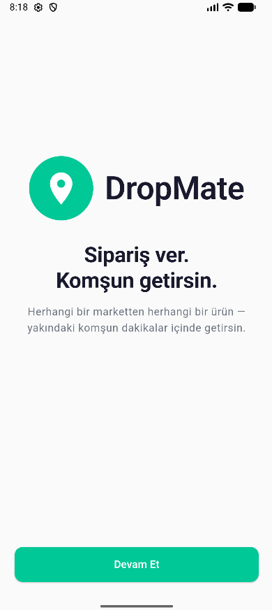
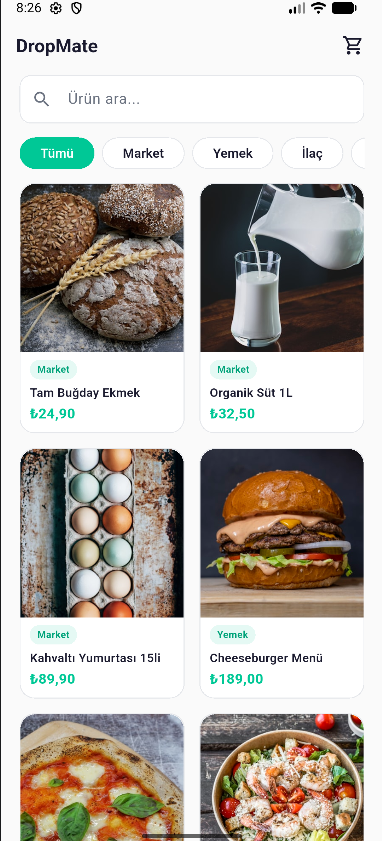
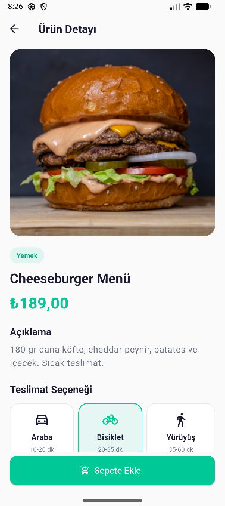
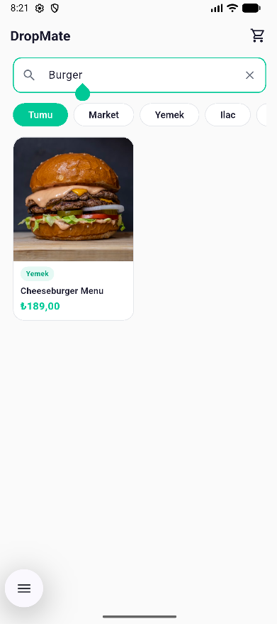
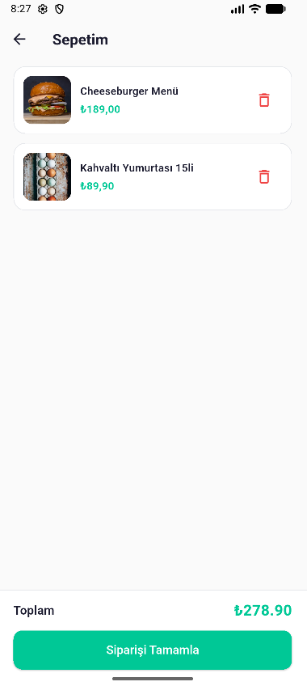

# DropMate - Mobil Mini Katalog (Flutter)

> **DropMate**, peer-to-peer (eşten eşe) bir teslimat platformudur.
> Tagline: _"Sipariş ver. Komşun getirsin."_

Bu repo, **Software Persona** stajı kapsamında **Efe Serin** tarafından
hazırlanan 4 projeden 4. proje olan **Mobil Uygulama (Flutter)** modülüdür.
"Mini Katalog" senaryosu üzerinden DropMate uygulamasının müşteri tarafı
ekranları (Welcome -> Home -> Detail -> Sepet) Flutter ile gerçeklenmiştir.

- **GitHub:** https://github.com/efesrnn/DropMate

## Özellikler

- **Stateless + Stateful** widget kullanımı (örn. `ProductCard` Stateless,
  `ProductListScreen` Stateful).
- **Navigator** ile iki tip yönlendirme:
  - `MaterialPageRoute` ile `Navigator.push` (Welcome -> Home, Home -> Sepet).
  - **Named route** + `arguments` (Home -> Detail).
- **Route Arguments** ile `Product` nesnesi detay ekranına aktarılır.
- **Model sınıfı** `Product` - `fromJson` / `toJson` destekli.
- **ListView.builder** (kategori chip satırı + sepet listesi) +
  **GridView.builder** (2 kolonlu ürün gridi).
- **Image.network** + `errorBuilder` fallback (yönerge: yalnızca `material.dart`).
- **Arama** (TextField) + **kategori filtresi** (ChoiceChip).
- **Sepet** durum simülasyonu: in-memory `ChangeNotifier` (DropMate marka
  paletinde altın renkli badge).
- **Komisyon hesaplayıcısı** - peer-to-peer mantığa uygun dinamik formül
  (`lib/utils/commission_calculator.dart`).
- **Tema:** Tüm renkler ve tipografi BRAND_IDENTITY ile birebir uyumlu.

## Yönerge Uyumu

- [x] Yalnızca `flutter/material.dart` paketi - ekstra `pub` paketi yok.
- [x] Null safety (Flutter 3+).
- [x] `const` constructor'lar yaygın kullanıldı.
- [x] Klasör yapısı: `lib/models`, `lib/screens`, `lib/widgets`, `lib/data`,
      `lib/theme`, `lib/utils`.
- [x] Türkçe açıklama yorumları her dosyanın başında.

## Klasör Yapısı

```
DropMate/
├── lib/
│   ├── data/
│   │   └── products.dart            # 18 ürün, 7 kategori (seed)
│   ├── models/
│   │   ├── cart_controller.dart     # ChangeNotifier tabanlı sepet
│   │   └── product.dart             # fromJson / toJson
│   ├── screens/
│   │   ├── welcome_screen.dart      # Splash + CTA
│   │   ├── product_list_screen.dart # Home: arama + filtre + grid
│   │   ├── product_detail_screen.dart
│   │   └── cart_screen.dart
│   ├── theme/
│   │   ├── app_colors.dart          # DropMate renk tokenleri
│   │   └── app_theme.dart           # ThemeData
│   ├── utils/
│   │   └── commission_calculator.dart
│   ├── widgets/
│   │   ├── dropmate_logo.dart
│   │   ├── search_field.dart
│   │   ├── category_chip_row.dart   # ListView.builder
│   │   ├── product_card.dart        # GridView item
│   │   ├── cart_icon_button.dart    # rozet
│   │   └── delivery_option_card.dart
│   └── main.dart                    # MaterialApp + named routes
├── assets/
│   └── images/                      # boş - Image.network kullanılır
├── screenshots/
│   ├── 01_welcome.png
│   ├── 02_home.png
│   ├── 03_detail.png
│   ├── 04_search.png
│   └── 05_basket.png
├── pubspec.yaml
├── analysis_options.yaml
├── .gitignore
└── README.md
```

## Çalıştırma

Gerekli: **Flutter 3.11+** (Dart 3.0+). Cihazda Flutter SDK kurulu olmalıdır.

```bash
# Paket bağımlılıklarını çek (yalnızca cupertino_icons çekilir)
flutter pub get

# Bağlı bir emülatör veya cihazda çalıştır
flutter run

# Statik analiz
flutter analyze
```

> Uygulama Unsplash'ten ağ üzerinden ürüne özel görsel yükler. Cihazda
> internet yoksa `Image.network`'ün `errorBuilder`'ı her ürün için kategoriye
> uygun bir ikon gösterir.

## Ekran Görüntüleri

| Welcome | Home | Detail |
| :---: | :---: | :---: |
|  |  |  |

| Arama (Search) | Sepet (Basket) |
| :---: | :---: |
|  |  |

## Renk Paleti

| Token | HEX | Kullanım |
| --- | --- | --- |
| `primary` | `#00C896` | CTA, fiyat, logo |
| `secondary` | `#1A1A2E` | Başlık, koyu metin |
| `accent` | `#FFB400` | Komisyon/rozet vurgusu |
| `bg` | `#FAFAFA` | Arkaplan |
| `surface` | `#FFFFFF` | Kart |

## Teslimat Modları

| Mod | Tahmini Süre | Min Komisyon | Max Komisyon |
| --- | :---: | :---: | :---: |
| Araba | 10-20 dk | ₺45 | ₺120 |
| Bisiklet | 20-35 dk | ₺25 | ₺75 |
| Yürüyüş | 35-60 dk | ₺15 | ₺40 |

Komisyon, `CommissionCalculator.calculate(...)` yardımcısı ile gerçek
teslimat süresine göre lineer olarak min-max arasında ölçeklendirilir;
global sistem üst limiti ₺120, alt limiti ₺15'tir.

---

**Geliştirici:** Efe Serin · **GitHub:** efesrnn · **E-posta:** efeserin02@gmail.com
